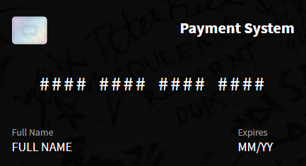

### *On Development Stage*

<h1 align="center">Credit card form, by Despicable</h1>

  

---
## Technologies used:

 

---

<h4>There is a problem, it's previewing on localhost, so it's not https protocol.

Browser that I use (Chrome), pushing a warning: 
<strong>automatic credit card filling is disabled</strong>

But it's working Ok!
</h4>